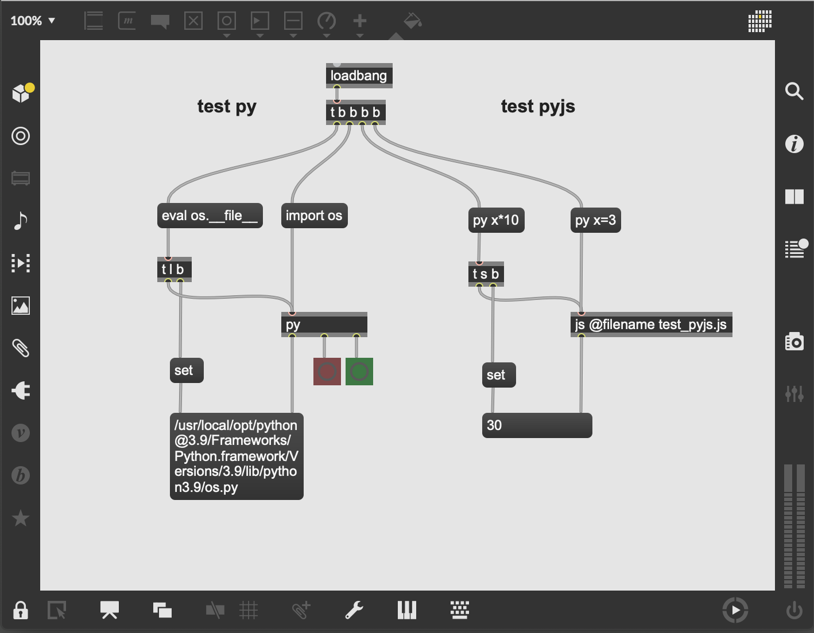
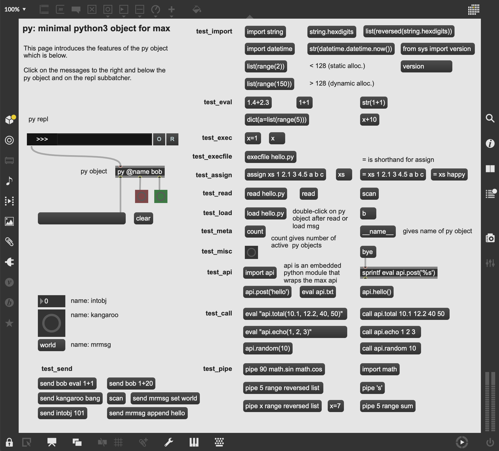
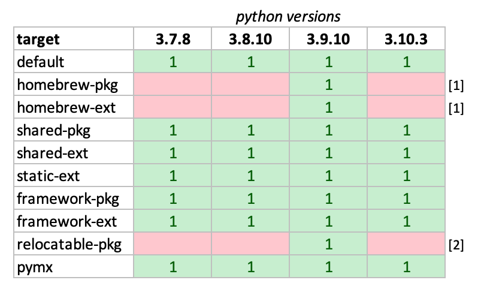

# py-js: python3 objects for max

Simple (and extensible) [python3](https://www.python.org) externals for [MaxMSP](https://cycling74.com).

Currently builds 'natively' on macOS `x86_64`and macOS `arm64`.

repo - <https://github.com/shakfu/py-js>

[](patchers/py_test_standalone.maxpat)

## Preface

This project started out as an attempt (during a covid-19 lockdown) to develop a basic python3 external for maxmsp. It then evolved into an umbrella project for exploring a number of different ways of using python3 in max.

To this end, a number of python3 externals have been developed for use in a live Max environment:

name     | sdk        | lang   | description
:------- | :--------- | :----: | :---------------------------------------------------
py       | max-sdk    | c      | well-featured, many packaging options + [cython](https://cython.org) api
pyjs     | max-sdk    | c      | js-friendly -- written as a Max javascript-extension
mxpy     | max-sdk    | c      | a translation of [pdpython](https://github.com/shakfu/pdpython) into Max
pymx [1] | min-devkit | c++    | concise, modern, using [pybind11](https://github.com/pybind/pybind11)
zpy      | max-sdk    | c      | uses [zeromq](https://zeromq.org) for 2way-comms with an external python process
cobra    | max-sdk    | c      | python3 external providing deferred and clocked function execution
mamba    | max-sdk    | c      | single-header library to nest a python3 interpreter in any external


[1] pymx been moved to its own [github project](https://github.com/shakfu/min.pymx)

The common objective in these externals is to help you use and distribute your python code and libraries in your Max applications. They are mostly differentiated in the ways that this is done and in the choice of packaging to serve different deployment requirements for your patch, package or standalone.

Please see below for a full overview and feature comparison of the externals.

For a sense of relative maturity, about 80% of development time to-date has gone into the first two externals (`py` and `pyjs`) with the remaining distributed in order of decreasing time to the others.

A significant time of this project has been devoted to developing and refining different ways of packaging and deploying the externals.

At the time of this writing, and since the switch to the new [max-sdk-base](https://github.com/cycling74/max-sdk-base), the project **is compatible with Apple Silicon-based machines** but only produces 'native' (`x86_64` or `arm64`) externals with no current or future plans to produce 'fat' or universal externals which serve both architectures. Codesigned and notarized `x86_64`-based and `arm64`-based python3 externals are provided in the [releases](https://github.com/shakfu/py-js/releases) section and available for download.

This README will mostly cover the first two externals (`py.mxo` and `pyjs.mxo`) and their many build variations. If you are interested in the others, please look into the `py-js/source/projects` section and please do ask questions or make suggestions via the project issue tracker. Such externals can be generally built using the following:

```bash
make cmake
```

For some of the less developed externals and experimental features please don't be surprised if Max seg-faults (especially if you start experimenting with the cython wrapped `api` module which operates on the c-level of the Max SDK).

## Cheatsheets for py and pyjs

The following will give you a sense of the feature differences between the two core python3 max externals:

### `py` external

```text
globals
    obj_count                    : number of active py objects
    registry                     : global registry to lookup object names

patchers
    subpatchers
        py_repl                  : a basic single line repl for py
        py_repl_plus             : embeds a py object in a py_repl

py max external
    attributes
        name                     : unique object name
        file                     : file to load into editor
        autoload                 : load file at start
        pythonpath               : add path to python sys.path
        debug                    : switch debug logging on/off

    methods (messages) 
        core
            import <module>      : python import to object namespace
            eval <expression>    : python 'eval' semantics
            exec <statement>     : python 'exec' semantics
            execfile <path>      : python 'execfile' semantics
        
        extra
            assign <var> [arg]   : max-friendly msg assignments to py object namespace
            call <pyfunc> [arg]  : max-friendly python function calling
            pipe <arg> [pyfunc]  : process a py/max value via a pipe of py funcs
            code <expr|stmt>     : alternative way to eval or exec py code
            anything <expr|stmt> : anything version of the code method 

        time-based
            sched <t> <fn> [arg] : defer a python function call by t millisecs

        code editor
            read <path>          : read text file into editor
            load <path>          : combo of read <path> -> execfile <path>
            run                  : run the current code in the editor
     
        interobject
            scan                 : scan patcher and store names of child objects
            send <msg>           : send an arbitrary message to a named object

        meta
            count                : give a int count of current live py objects

    inlets
        single inlet             : primary input (anything)

    outlets
        left outlet              : primary output (anything)
        middle outlet            : bang on failure
        right outlet             : bang on success 
```

[](patchers/py_test_anything.maxpat)

### `pyjs` external

```text
pyjs max external (jsextension)
    attributes
        name                     : unique object name
        file                     : file to load in object namespace
        pythonpath               : add path to python sys.path
        debug                    : switch debug logging on/off
    
    methods 
        core (messages)
            import <module>      : python import to object namespace
            eval <expression>    : python 'eval' semantics
            exec <stmnt>         : python 'exec' semantics
            execfile <path>      : python 'execfile' semantics
        
        extra
            code <expr|stmt>     : eval/exec/import python code (see above)
            

        in-code (non-message)
            eval_to_json <expr>  : python 'eval' returns json

```

## Quickstart

As mentioned earlier, the `py` and `pyjs` objects are the most mature and best documented of the collection. Happily, there is also no need to compile them as they are available for download, fully codesigned and notarized, from the [releases](https://github.com/shakfu/py-js/releases) section.

If you'd rather build them yourself then the process is straightforward:

1. You should have a modern `python3` cpython implementation installed on your Mac: preferably either from [python.org](https://www.python.org) or from [Homebrew](https://brew.sh). Note that even system python3 provided by Apple will work in a number of cases. Python versions from 3.7 to 3.10 are tested and known to work.

2. Make sure you also have [Xcode](https://xcodereleases.com/) installed.

3. Git clone the `py-js` [repo](https://github.com/shakfu/py-js) to a path without a space and without possible icloud syncing (i.e don't clone to `$HOME/Documents/Max 8/Packages`) [?] and run the following in the cloned repo:

    ```bash
    make setup
    ```

    The above will initialize and update the required git submodules and symlink the repo to `$HOME/Documents/Max 8/Packages/py-js` to install it as a Max Package and enable you to test the externals and run the patches.

    [?] It is possible to install `py-js` directly into `$HOME/Documents/Max 8/Packages`, but it is requires moving the place of compilation to a location in your filesystem which is not exposed to errors due to icloud syncing or spaces in the path. This split is possible, but it is not recommended for the purposes of this quickstart.

4. (Optional) Install [cython](https://cython.org) via `pip3 install cython`, which is used for wrapping the max api and worth installing in case you want to play around or extend the max api wrapper (which it is written in cython).

5. Type the following in the root directory of the `py-js` source (other installation options are detailed below):

    ```bash
    make
    ```

Open up any of the patch files in the `patcher` directory of the generated max package, and also look at the `.maxhelp` patchers to understand how the `py` and the `pyjs` objects work.

Note that the default build converts the `py-js` repo into a Max package by virtue of the symlink to `$HOME/Documents/Max 8/Packages/py-js` and enables the two recently created python3 externals in the `externals` folder (which are linked to your system python3) to be available to your Max environment.

This has the immediate benefit that you have access to your curated collection of python packages. The tradeoff is that these externals are dynamically linked with local dependencies and therefore not usable in standalones and relocatable Max packages.

No worries, if you need portable relocatable python3 externals for your package or standalone then read on!

### Alternative Quickstart for Self-contained Python3 Externals / Packages

idx  | command               | type       | format     | py size |  pyjs size
:--: | :-------------------- | :--------- | :--------- | :------ | :----------
1    | `make static-ext`     | static     | external   | 9.0     | 8.8
2    | `make shared-ext`     | shared     | external   | 16.7    | 16.5
3    | `make framework-pkg`  | framework  | package    | 22.8    | 22.8 [1]

[1] size, in this case, is not the individual external but uncompressed size of the package which includes patches, help files and both externals, and can vary by python version used to compile the external.

This alternative quickstart assumes that you have a recent python3 installation (python.org, homebrew or otherwise).

Again, if you'd rather not compile anything there are self-contained python3 externals which can be included in standalones in the [releases](https://github.com/shakfu/py-js/releases) section.

If you don't mind compiling (and have xcode installed) then pick one of the following options:

1. To build statically-compiled self-contained python3 externals:

    ```bash
    make static-ext
    ```

2. To build self-contained python3 exernals which include a dynamically linked libpythonX.Y.dylib:

    ```bash
    make shared-ext
    ```

3. To build python3 externals in a package, linked to a python installation in its `support` folder

    ```bash
    make framework-pkg
    ```

With all three options, a python3 source distribution (matching your own python3 version) is automatically downloaded from [python.org](https://www.python.org) with dependencies, and then compiled into a static or shared version of python3 which is then used to compile the externals.

At the end of this process you should find two externals in the `py-js/externals` folder: `py.mxo` and `pyjs.mxo`.

Although the three options deliver somewhat different products (see below for details), with options (1) and (2) the external 'bundle' contains an embedded python3 interpreter with a zipped standard library in the `Resources` folder and also has a `site-packages` directory for your own code.

With option (3), the externals are linked to, and have been compiled against, a relocatable python3 installation in the `support` folder.

Depending on your choice above, the python interpreter in each external is either statically compiled or dynamically linked, and in all three cases we have a self-contained and relocatable structure (external or package) without any non-system dependencies. This makes it appropriate for use in Max Packages and Standalones.

There are other [build variations](#build-variations) which are discussed in more detail below. You can always see which ones are available via typing `make help` in the `py-js` project folder:

```bash
$ make help

>>> pyjs targets
make default              : non-portable pyjs externals linked to your system
make homebrew-pkg         : portable package w/ pyjs (requires homebrew python)
make homebrew-ext         : portable pyjs externals (requires homebrew python)
make shared-pkg           : portable package with pyjs externals (shared)
make shared-ext           : portable pyjs externals (shared)
make static-ext           : portable pyjs externals (static)
make framework-pkg        : portable package with pyjs externals (framework)
make framework-ext        : portable pyjs externals (framework)
make relocatable-pkg      : portable package w/ more custom options (framework)

>>> python targets
make python-shared        : minimal shared python build
make python-shared-ext    : minimal shared python build for externals
make python-shared-pkg    : minimal shared python build for packages
make python-static        : minimal statically-linked python build
make python-framework     : minimal framework python build
make python-framework-ext : minimal framework python build for externals
make python-framework-pkg : minimal framework python build for packages
make python-relocatable   : custom relocatable python framework build
```

### Automated Test of Build Variations

If you would like to see which build variations are compatible with your current setup, there's an automated test which attempts to compile all build variations in sequence and will log all results to a `logs` directory in the project and provide a report of build times and success rates:

```bash
make test
````

This can take a long time, but it is worth doing to understand which variations works on your particular setup.

If you want to test or retest one individual variation, just prefix `test-` to the name of variation as follows:

```bash

make test-shared-pkg
```

### Using Self-contained Python Externals in a Standalone

If you have downloaded any pre-build externals from [releases](https://github.com/shakfu/py-js/releases) or if you have built self-contained python externals as per the methods above, then you should be ready to use these in a standalone.

As a side note: to release externals in a standalone they must be codesigned and notarized. To this end, there are scripts in `py-js/source/py/scripts` to make this a little easier.

### py.mxo

If you included `py.mxo` as an external in your standalone, then you should have no issue as Max will install it automatically during its build-as-standalone process.

You can test if it works without issues by building either of these two example patcher documents, included in `py-js/patchers`, as a max standalone:

1. `py_test_standalone_info_py.maxpat`

2. `py_test_standalone_only_py.maxpat`

Open the resulting standalone and test that the `py` object works as expected.

To demonstrate the above, a pre-built standalone that was built using exactly the same steps as above is in the releases section: `py_test_standalone_demo.zip`.

### pyjs.mxo

If you included `pyjs.mxo` as an external in your standalone, then you it may be a litte more involved: 

You can test first if it works without issues by building the following patcher, included in `py-js/patchers`, as a max standalone:

- `py_test_standalone_only_pyjs.maxpat`

Open the resulting standalone and test that the `pyjs` object works as expected. If it doesn't then try the following workaround:

To fix a sometimes recurrent issue where the standalone build algorithm doesn't pick up `pyjs.mxo`: if you look inside the built standalone bundle, `py_test_standalone_only_pyjs.app/Contents/Resources/C74/externals` you may not find `pyjs.mxo`. This is likely a bug in Max 8 but easily resolved. Fix it by manually copying the `pyjs.mxo` external into this folder and then copy the `javascript` and `jsextensions` folders from the root of the `py-js` project and place them into the `pyjs_test_standalone.app/Contents/Resources/C74` folder. Now re-run the standalone app again and now the `pyjs` external should work. If anyone knows of some scripting at the standalone build step to automate the manual fix above it woulld be greatly appreciated.

Please read on for further details about what the py-js externals can do.

Have fun!

## Overview

This overview will cover the following two external implementations:

1. A `py` external which provides a more featureful two-way interface between max and python in a way that feels natural to both languages.

2. A `pyjs` max external/jsextension providing a `PyJS` class and a minimal subset of the `py` external's features which work well with the max `js` object and javascript code (like returning json directly from evaluations of python expressions).

Both externals have access to builtin python modules and the whole universe of 3rd party modules, and further have the option of importing a builtin `api` module which uses [cython](https://cython.org) to wrap selective portions of the max c-api. This allows regular python code to directly access the max-c-api and script Max objects.

There are 3 general deployment variations:

1. Linking the externals to your system python (homebrew, built from source, etc.) This has the benefit of re-using your existing python modules and is the default option.

2. Embedding the python interpreter in a Max package: in this variation, a dedicated python distribution (zipped or otherwise) is placed in the `support` folder of the `py/js` package (or any other package) and is linked to the `py` external or `pyjs` extension (or both). This makes it size efficient and usable in standalones.

3. The external itself as a container for the python interpreter: a custom python distribution (zipped or otherwise) is stored inside the external bundle itself, which can make it portable and usable in standalones.

As of this writing all three deployment scenarios are availabe, however it is worth looking more closely into the tradeoffs in each case, and a number of build variations exist. This topic is treated in more detail below (see [Build Variations](#build-variations))

Deployment Scenario  | `py` | `pyjs`
:------------------- | :--: | :--------:
Link to sys python   | 1    | 1
Embed in package     | 1    | 1
Embed in external    | 1    | 1

### Key Features

The `py` external has the following c-level methods:

category | method   | param(s)      | in/out | can change ns
:------- | :--------| :------------ | :----: | :------------:
core     | import   | module        | in     | yes
core     | eval     | expression    | out    | no
core     | exec     | statement     | in     | yes
core     | execfile | file          | in     | yes
extra    | assign   | var, data     | in     | yes
extra    | call     | var(s), data  | out    | no
extra    | code     | expr or stmt  | out?   | yes
extra    | anything | expr or stmt  | out?   | yes
extra    | pipe     | var, funcs    | out    | no
time     | sched    | ms, fun, args | out    | no
editor   | read     | file          | n/a    | no
editor   | load     | file          | n/a    | no
interobj | scan     |               | n/a    | no
interobj | send     | name, msg, .. | n/a    | no
meta     | count    |               | n/a    | no

The `pyjs` external implements the following c-level methods:

category | method       | param(s)      | in/out | can change ns
:------- | :----------- | :------------ | :----: | :------------:
core     | import       | module        | in     | yes
core     | eval         | expression    | out    | no
core     | exec         | statement     | in     | yes
core     | execfile     | file          | in     | yes
extra    | code         | expr or stmt  | out?   | yes
in-code  | eval_to_json | expression    | out    | no

In both cases, the `code` method allows for import/exec/eval of python code, which can be said to make those 'fit-for-purpose' methods redundant. However, I have retained them since they are stricter in what they allow and further provide a helpful prefix in messages which indicates message intent.

#### Core

py/js's *core* features have a one-to-one correspondance to python's *very high layer* as specified [here](https://docs.python.org/3/c-api/veryhigh.html). In the following, when we refer to *object*, we refer to instances of either the `py` or `pyjs` externals. A note of differences between the variations will be provided below.

- **Per-object namespaces**. Each object has a unique name (which is provided automatically or can be set by the user), and responds to an `import <module>` message which loads the specified python module in its namespace (essentially a `globals` dictionary). Notably, namespaces can be different for each instance.

- **Eval Messages**. Responds to an `eval <expression>` message in the left inlet which is evaluated in the context of the namespace. `py` objects output results to the left outlet, send a bang from the right outlet upon success or a bang from the middle outlet upon failure. `pyjs` objects just return an `atomarray` of the results.

- **Exec Messages**. Responds to an `exec <statement>` message and an `execfile <filepath>` message which executes the statement or the file's code in the object's namespace. For `py` objects, this produces no output from the left outlet, sends a bang from the right outlet upon success or a bang from the middle outlet upon failure. For `pyjs` objects no output is given.

#### Extra

The *extra* category of methods  makes the `py` or `pyjs` object play nice with the max/msp ecosystem:

Implemented for `py` objects at present:

- **Assign Messages**. Responds to an `assign <varname> [x1, x2, ..., xN]` which is equivalent to `<varname> = [x1, x2, ..., xN]` in the python namespace. This is a way of creating variables in the object's python namespace using max message syntax. This produces no output from the left outlet, a bang from the right outlet upon success, or a bang from the middle outlet upon failure.

- **Call Messages**. Responds to a `call <func> arg1 arg2 ... argN` kind of message where `func` is a python callable in the py object's namespace. This corresponds to the python `callable(*args)` syntax. This makes it easier to call python functions in a max-friendly way. If the callable does not have variable arguments, it will alternatively try to apply the arguments as a list i.e. `call func(args)`. Future work will try make `call` correspond to a python generic function call: `<callable> [arg1 arg2 ... arg_n] [key1=val1 key2=val2 ... keyN=valN]`. This outputs results to the left outlet, a bang from the right outlet upon success, or a bang from the middle outlet upon failure.

- **Pipe message**. Like a `call` in reverse, responds to a `pipe <arg> <f1> <f2> ... <fN>` message. In this sense, a value is *piped* through a chain of python functions in the objects namespace and returns the output to the left outlet, a bang from the right outlet upon success, or a bang from the middle outlet upon failure.

Implemented for both `py` and `pyjs` objects:

- **Code or Anything Messages**. Responds to a `code <expression || statement>` or (anything) `<expression || statement>` message. Arbitrary python code (expression or statement) can be used here, because the whole message body is converted to a string, the complexity of the code is only limited by Max's parsing and excaping rules. (EXPERIMENTAL and evolving).

Implemented for `pyjs` objects only:

- **Evaluate to JSON**. Can be used in javascript code only to automatically serialize the results of a python expression as a json string as follows: `evaluate_to_json <expression> -> JSON`.

#### Interobject Communication

Implemented for `py` objects only:

- **Scan Message**. Responds to a `scan` message with arguments. This scans the parent patcher of the object and stores scripting names in the global registry.

- **Send Message**. Responds to a `send <object-name> <msg> <msg-body>` message. Used to send *typed* messages to any named object. Evokes a `scan` for the patcher's objects if a `registry` of names is empty.

#### Editing Support

Implemented for `py` objects only.

- **Line REPL**. The `py`has two bpatcher line `repls`, one of which embeds a `py` object and another which has an outlet to connect to one. The repls include a convenient menu with all of the `py` object's methods and also feature coll-based history via arrow-up/arrow-down recall of entries in a session. Of course, a coll can made to save all commands if required.

- **Experimental Remote Console**. A new method (due to [Iain Duncan](https://github.com/iainctduncan)) of sending code to the `py` node via `udp` has been implemented and allows for send-from-editor and send-from-interactive-console capabilities. The clients are still in their infancy, but this method looks promising since you get syntax highlighting, syntax checking, and other features. It assumes you want to treat your `py` nodes as remotely accessible `server/interpreters-in-max`.

- **Code Editor**. Double-clicking the `py` object opens a code-editor. This is populated by a `read` message which reads a file into the editor and saves the filepath to an attribute. A `load` message also `reads` the file followed by `execfile`. Saving the text in the editor uses the attribute filepath and execs the saved text to the object's namespace.

For `pyjs` objects, code editing is already provided by the [js](https://docs.cycling74.com/max8/refpages/js) Max object.

#### Scripting

Implemented for both `py` and `pyjs` objects:

- **Exposing Max API to Python** A portion of the max api in `c74support/max-includes` has been converted to a cython `.pxd` file called `api_max.pxd`. This makes it available for a cython implementation file, `api.pyx` which is converted to c-code during builds and embedded in the external. This code enables a custom python builtin module called `api` which can be imported by python scripts in `py` objects or via `import` messages to the object. This allows the subset of the max-api which has been wrapped in cython code to be called directly by python scripts or via messages in a patcher.

## Caveats

- Packaging and deployment of python3 externals has improved considerably but is still a work-in-progress: basically needing further documentation, consolidation and cleanup. For example, there are currently two build systems which overlap: a newer python3 based build system to handle simple to complex cases, and an older bash/makefile build system (which is deprecated and will be deleted eventually).

- Despite their relative maturity, the `py` and `pyjs` objects are only v0.1 and still need further unit/functional/integration testing and field testing of course!

- As of this writing, the `api` module, does not (like apparently all 3rd party python c-extensions) unload properly between patches and requires a restart of Max to work after you close the first patch which uses it. Unfortunately, this is a known [bug](https://bugs.python.org/issue34309) in python which is being worked on and may be [fixed](https://groups.google.com/forum/?utm_medium=email&utm_source=footer#!msg/cython-users/SnVpCE7Sq8M/hdT8S2iFBgAJ) in future versions (python 3.11 perhaps?).

- `Numpy`, the popular python numerical analysis package, falls in the above category. In python 3.9.x, it thankfully doesn't crash but gives the following error:

```bash
[py __main__] import numpy: SystemError('Objects/structseq.c:401: bad argument to internal function')
```

This just means that the user opened a patch with a `py-js` external that imports `numpy`, then closed the patch and (in the same Max session) re-opened it, or created a new patch importing `numpy` again.

To fix it, just restart Max and use it normally in your patch. Treat each patch as a session and restart Max after each session. It's a pain, but unfortunately a limitation of current python c-extensions.

- `core` features relying on pure python code are supposed to be the most stable, and *should* not crash under most circumstances, `extra` features are less stable since they are more experimental, etc..

- The `api` module is the most experimental and evolving part of this project, and is completely optional. If you don't want to use it, don't import it.

### Current Status of Builders

As of this writing this project uses a combination of a `Makefile` in the project root and a custom python build system which resides in the `py-js/source/py/builder` package. The `Makefile` is a kind of 'frontend' to the more complex python system. The latter can be used directly of course. A view into its many options can be obtained by typing the following:

```bash
cd py-js/source/py
python3 -m builder --help
```

The python system was developed to handle the complex case of downloading the source code of python (from python.org) and its dependencies from their respective sites and then building custom python binaries with which to reliably compile python3 externals which are portable, relocatable, self-contained, small-in-size, and therefore usable in Max Packages and Standalones.

### Build Variations

One of the objectives of this project is to cater to a number of build variations. As of this writing, the following table gives an overview of the different builds and their differences:

There is generally tradeoff of size vs. portability:

build command       | format       | size_mb  | deploy_as | pip      | portable | numpy    | isolated |
:-------------------| :----------- | :------: | :-------: | :-------:| :-------:| :-------:| :-------:|
make                | framework    | 0.3      | external  | yes [1]  | no       | yes      | yes      |
make brew-ext       | hybrid  [3]  | 13.6     | external  | no       | yes      | yes      | no       |
make brew-pkg       | hybrid  [3]  | 13.9     | package   | yes      | yes      | yes      | yes      |
make static-ext     | static       | 9.0      | external  | no       | yes      | no [2]   | yes      |
make shared-ext     | shared       | 15.7     | external  | no       | yes      | yes      | no       |
make shared-pkg     | shared       | 18.7     | package   | yes      | no [4]   | yes      | yes      |
make framework-ext  | framework    | 16.8     | external  | no       | yes      | yes      | no       |
make framework-pkg  | framework    | 16.8     | package   | yes      | yes      | yes      | yes      |

[1] has automatic access to your system python's site-packages

[2] current static external implementation does not work with numpy due to symbol access issues.

[3] *hybrid* means that the source system was a `framework` and the destination system is `shared`.

[4] the shared-pkg variant does build a compliant 'Framework-type' bundle and hence cannot be notarized.

- *pip*: the build allows or provides for pip installation

- *portable*: the externals can be deployed as portable packages or standalones

- *numpy*: numpy compatibility

- *isolated*: if yes, then different external types can run concurrently without issue

#### Python Version Compatibility



[1] Homebrew only tested on current relase (3.9.10), other versions are expected to work without issues.

[2] Relocatable python can selected on its own version of python. Only testing python 3.9.10, other versions should work without issues

#### Packages vs Self-contained Externals

The Max package format is a great way to move a bunch of related patches and externals around. This format also makes a lot of sense for `py-js`, giving a number of advantages over other alternatives:

1. Portable: Relocatable, you can move it around and it still works.

2. Extendable: Can include a full fit-for-purpse python3 installation in the `support` directory with its own site-packages. Packages can be `pip` installed and all of the `site-packages` is automatically made available to the thin 'client' python3 externals in the package's `externals` folder.

3. Size-efficient, since you don't need to duplicate functionality in each external

4. Standalone installable: Recent changes in Max have allowed for this to work in standalones. Just create your standalone application from a patcher which which includes the `py` and `pyjs` objects. Once it is built into a `<STANDALONE>` then copy the whole aforementioned `py` package to `<STANDALONE>/Contents/Resources/C74/packages` and delete the redundant `py.mxo` in `<STANDALONE>/Contents/Resources/C74/externals` since it already exists in the just-copied package.

5. Better for codesigning / notarizing scenarios since Packages are not sealed bundles like externals.

On the other hand, sometimes you just want an external which embeds a python distribution and custom extensions and code:

1. Portable: Relocatable, you can move it around and it still works.

2. Extendable: Can include new pure python code and be provided with new additionas to `sys.path`

3. Size-efficient and fit-for-purpose

4. Standalone installable. Easiest to install in standalones

5. Can be codesigned and notarized relatively easily. [1]

[1] If you want to codesign and notarize it for use in your standalone or package, the [codesigning / notarization script](source/py/scripts/notarize.sh) and related [entitlements file](source/py/scripts/entitlements.plist) can be found in the [source/py/scripts](source/py/scripts) folder.

### The pymx variation

The `pymx` external is a max wrapper of the python interpreter using the `min-api` `c++` version of the Max api.

This needs:

1. [pybind11](https://pybind11.readthedocs.io) which is used for wrapping the alternative `min-api` `c++` version of the Max api to make it accessible to python.

2. [cmake](https://cmake.org) is used in the `min-api` build system.

First, install `cmake` and `pybind11` using homebrew:

```bash
brew install cmake
```

```bash
brew install pybind11
```

then type the following  in the root of the project:

```bash
make pmx
```

### The relocatable-python variation

[relocatable-python](https://github.com/gregneagle/relocatable-python) is Greg Neagle's excellent tool for building standalone relocatable Python.framework bundles.

It works so well, that its been included in the `builder` application as an external (embedded dependency).

It can be seen in the `relocatable-pkg` make option which will download a nice default `Python.framework` to the `support` directory used for compiled both `py` and `pyjs` externals:

```bash
make relocatable-pkg
```

More options are available if you use the `builder` package directly:

```bash
$ cd py-js/source/py

     python3 -m builder pyjs relocatable_pkg --help
usage: __main__.py pyjs relocatable_pkg [-h] [--destination DESTINATION]
                                        [--baseurl BASEURL]
                                        [--os-version OS_VERSION]
                                        [--python-version PYTHON_VERSION]
                                        [--pip-requirements PIP_REQUIREMENTS]
                                        [--no-unsign] [--upgrade-pip]
                                        [--without-pip]

optional arguments:
  -h, --help            show this help message and exit
  --destination DESTINATION
                        Directory destination for the Python.framework
  --baseurl BASEURL     Override the base URL used to download the framework.
  --os-version OS_VERSION
                        Override the macOS version of the downloaded pkg.
                        Current supported versions are "10.6", "10.9", and
                        "11". Not all Python version and macOS version
                        combinations are valid.
  --python-version PYTHON_VERSION
                        Override the version of the Python framework to be
                        downloaded. See available versions at
                        https://www.python.org/downloads/mac-osx/
  --pip-requirements PIP_REQUIREMENTS
                        Path to a pip freeze requirements.txt file that
                        describes extra Python modules to be installed. If not
                        provided, no modules will be installed.
  --no-unsign           Do not unsign binaries and libraries after they are
                        relocatablized.
  --upgrade-pip         Upgrade pip prior to installing extra python modules.
  --without-pip         Do not install pip.
```

### Sidenote about building on a Mac

If you are developing the package in `$HOME/Documents/Max 8/Packages/py` and you have your iCloud drive on for Documents, you will find that `make` or `xcodebuild` will reliably fail with 1 error during development, a codesigning error that is due to icloud sync creating detritus in the dev folder. This can be mostly ignored (unless your only focus is codesigning the external).

The solution is to move the external project folder to a non iCloud drive folder (such as $HOME/Downloads for example) and then run "xattr -cr ." in the project directory to remove the detritus (ironically which Apple's system is itself creating) and then it should succeed (provided you have your Info.plist and bundle id correctly specified). The just symlink the folder to `$HOME/Documents/Max 8/Packages/` to prevent this from recurring.

I've tried this several times and  and it works (for "sign to run locally" case and for the "Development" case).

### Code Style

The coding style for this project can be applied automatically during the build process with `clang-format`. On OS X, you can easily install this using brew:

```bash
brew install clang-format
```

The style used in this project is specified in the `.clang-format` file.

## Related projects

- [relocatable-python](https://github.com/gregneagle/relocatable-python): A tool for building standalone relocatable Python.framework bundles. (used in this project)

- [python-build-standalone](https://github.com/indygreg/python-build-standalone): Produce redistributable builds of Python. (Interesting but not used in this project)

- [Python Apple Support](https://github.com/beeware/Python-Apple-support): A meta-package for building a version of Python that can be embedded into a macOS, iOS, tvOS or watchOS project. (directly inspired static linking approach)

- [py2max](https://github.com/shakfu/py2max) : using python3 with Max in an offline capacity to generate max patches.

- [maxutils](https://github.com/shakfu/maxutils) : scripts and utilities to help with codesigning and notarization of Max standalones and externals.

## Prior Art and Thanks


I was motivated to start this project because I found myself recurrently wanting to use some python libraries or functions in Max.

Looking around for a python max external I found the following:

- Thomas Grill's [py/pyext – Python scripting objects for Pure Data and Max](https://grrrr.org/research/software/py/) is the most mature Max/Python implementation and when I was starting this project, it seemed very promising but then I read that the 'available Max port is not actively maintained.' I also noted that it was written in C++ and that it needed an additional [c++ flext](http://grrrr.org/ext/flext) layer to compile. I was further dissuaded from diving in as it supported, at the time, only python 2 which seemed difficult to swallow considering Python2 is basically not developed anymore. Ironically, this project has become more active recently, and I finally was persuaded to go back and try to compile it and finally got it running. I found it to be extremely technically impressive work, but it had probably suffered from the burden of having to maintain several moving dependencies (puredata, max, python, flext, c++). The complexity probably put off some possible contributors which have made the maintenance of the project easier for Thomas. In any case, it's an awesome project and it would be great if this project could somehow help py/ext in some way or the other.

- [max-py](https://github.com/njazz/max-py) -- Embedding Python 2 / 3 in MaxMSP with `pybind11`. This looks like a reasonable effort, but only 9 commits and no further commits for 2 years as of this writing.

- [nt.python_for_max](https://github.com/2bbb/nt.python_for_max) -- Basic implementation of python in max using a fork of Graham Wakefield's old c++ interface. Hasn't really been touched in 3 years.

- [net.loadbang.jython](https://github.com/cassiel/net.loadbang.jython) -- A
  jython implementation for Max which uses the MXJ java interface. It's looks
  like a solid effort using Jython 2.7 but the last commit was in 2015.

Around the time of the beginning of my first covid-19 lockdown, I stumbled upon Iain Duncan's [Scheme for Max](https://github.com/iainctduncan/scheme-for-max) project, and I was quite inspired by his efforts and approach to embed a scheme implementation into a Max external.

So it was decided, during a period with less distractions than usual, to try to make a minimal python3 external, learn the max sdk, the python c-api, and how to write more than a few lines of c that didn't crash.

It's been an education and I have come to understand precisely a quote I remember somewhere about the c language: that it's "like a scalpel". I painfully now understand this to mean that in skilled hands it can do wonders, otherwise you almost always end up killing the patient.

Thanks to Luigi Castelli for his help on Max/Msp questions, to Stefan Behnel for his help with Cython questions, and to Iain Duncan for providing the initial inspiration and for saving me time with some great implementation ideas.

Thanks to Greg Neagle for zeroing in on the relocatability problem and sharing his elegant solution for Python frameworks via his [relocatable-python](https://github.com/gregneagle/relocatable-python) project on Github.
